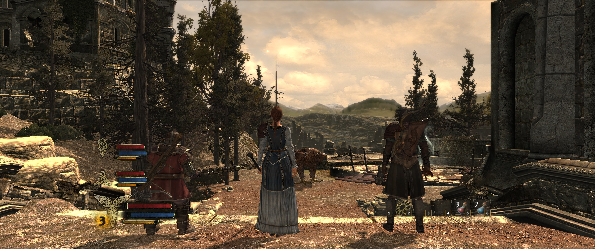
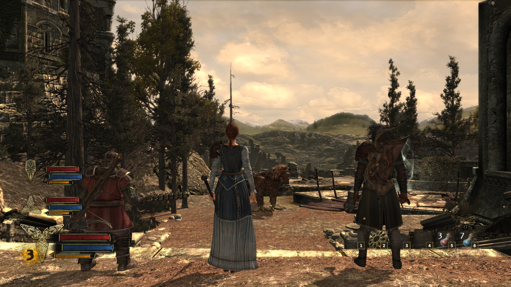
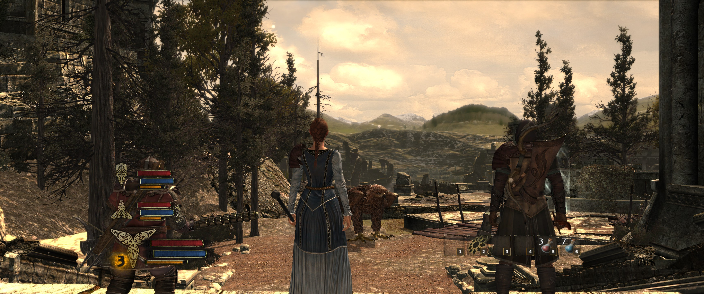

# Ultrawide patch for War in the North (Legacy Edition)

21:9 and 32:9 support for *The Lord of the Rings: War in the North*, the Aspyr
Legacy Edition on Steam.

The game ships with a whitelist of four aspect ratios and throws away every
display mode that isn't one of them, so ultrawide resolutions never even reach
the resolution menu. Three other places assume 16:9 on top of that. This fixes
all of it.



## Install

1. Drop `ultrawide_patch.bat` and `ultrawide_patch.ps1` into the game folder,
   next to `witn.exe`. In Steam: right click the game, Manage, Browse local
   files. Usually:

   ```
   ...\Steam\steamapps\common\LORWIN\
   ```

2. Close the game if it's running.
3. Run `ultrawide_patch.bat` and press **A**.
4. Options, Settings, Video, Change Resolution. Your mode should be in the list.

Press **R** in the same menu to undo it. The original exe is kept next to the
patched one as `witn.exe.orig`, so reverting is just a file copy.

## What it changes

**Ultrawide modes show up in the resolution menu.** 2560x1080, 3440x1440,
3840x1600, 5120x2160 and 32:9 all work - one whitelist slot plus a widened
tolerance covers the whole family.

**The HUD isn't cut off any more.** Unpatched, a 21:9 screen loses about 85
rows off the top and bottom of the interface: the compass vanishes completely,
and the party health bars and hotbar get sliced by the screen edge.

**You actually see more of the world.** This one surprised me. Unpatched, a
21:9 screen shows exactly the same view left to right as 16:9 does and just
crops the top and bottom away, so the extra width costs you picture instead of
adding any. Patched, the vertical view matches 16:9 and the extra width becomes
extra world at the sides - Hor+, which is what you want on an ultrawide.

| | |
|---|---|
|  | 2560x1440 |
|  | 3440x1440, patched - same spot, same vertical view, more world |
|  | 3440x1440 before the FOV fix - note how much less is in frame |

Anything at 16:9 or narrower comes out bit for bit identical to the unpatched
game.

## Known issues

Two things aren't right. Both cosmetic, both known:

- The character select screen - the three heroes standing side by side - is
  still stretched horizontally. It uses a different camera from the rest of the
  game and has resisted the fix so far.
- Shadows stop a little short of the far left and right edges. The wider view
  is genuinely wider, but the shadow pass still only covers the area a 16:9
  screen would have shown, so the outermost slice gets drawn without them.
  Nothing flickers and nothing is missing; shadows just fade out near the
  edges. Widening the shadow pass would spread the same shadow map over more
  ground and make shadows softer everywhere, which is a worse deal, so I left
  it.

And one deliberate trade-off: **4:3 and 5:4 modes disappear** from the
resolution list. The whitelist is a fixed-size array in the game, so adding
entries isn't possible - two had to be swapped out.

## If the resolution menu won't take

The game remembers its own resolution in a settings file, and if the mode it
has saved is one your monitor can't display, the picture gets cropped and the
menu can be awkward to escape from. Changing your Windows desktop resolution
does *not* change what the game renders.

Press **S** and type what you actually want, e.g. `2560x1080`. That writes it
straight into `GameSettings.dat` and fixes up the checksum, so the game starts
at that resolution without you having to pick it from the list.

If something's still wrong, press **D**. That writes `ultrawide_report.txt`
next to the game saying whether the patch is applied, whether your copy matches
the build this was written for, and what resolution the game itself has saved.
Attach that when you report a problem - it answers in one go what otherwise
takes several rounds of guessing.

## Which build

Steam Legacy Edition, `witn.exe`, 13,075,456 bytes:

```
SHA256  ADF1753F4F182E3C4287EEEA19CEDDB5B91F3386C73D1D17B8F0B8171A9C219F
```

Every byte range is verified before anything gets written, so on any other
build the patcher stops and changes nothing rather than corrupting your exe.
If yours doesn't match, press D and post the report - it prints what it found
where it expected something else, which is enough to work out whether the patch
can be moved over.

## Notes

- Steam's "Verify integrity of game files" restores the stock exe. Just run the
  patcher again afterwards. Same after a game update.
- If Windows SmartScreen complains about the `.bat`, it's because the file was
  downloaded. Right click, Properties, tick Unblock.
- `witn.exe` is locked while the game is running. The patcher fails cleanly and
  writes nothing.
- If it crashes, press R to revert and note where it died - startup, main menu,
  or entering gameplay. That narrows it down a lot.

## How it works

`witn_ultrawide.py` is a Python version of the same patcher - same 13 patches,
byte-identical result. Its comments document every one of them: the addresses,
what the original code did, what the replacement does, and why. If you want to
know what's being written to your exe before you run it, read that file.

Short version: two of the four whitelist entries get replaced and the
mode-matching epsilon is repointed at a wider constant that already exists in
`.rdata`. The UI canvas function and the HUD's inlined copy of the same maths
get anchored to height instead of width above 16:9. The character select camera gets the real aspect instead of a hardcoded 16/9.
And both perspective-matrix builders get a hook that converts the projection
from Vert- to Hor+ above 16:9.
Everything that doesn't fit in place jumps into the zero padding at the tail of
`.text`.

## No game files here

This repository contains only the patcher scripts. No game code, no game
assets, no patched executable. It edits your own legally owned copy in place
and keeps a backup next to it.

## Licence

MIT, see [LICENSE](LICENSE).
